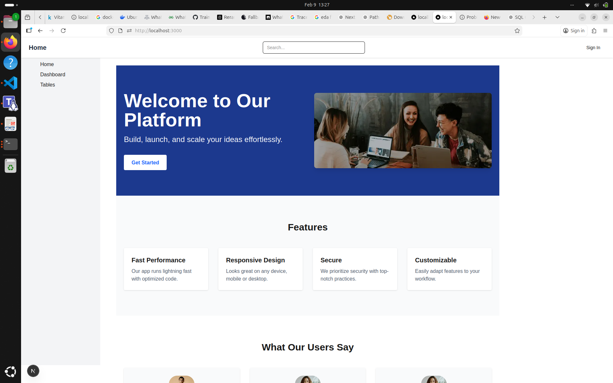
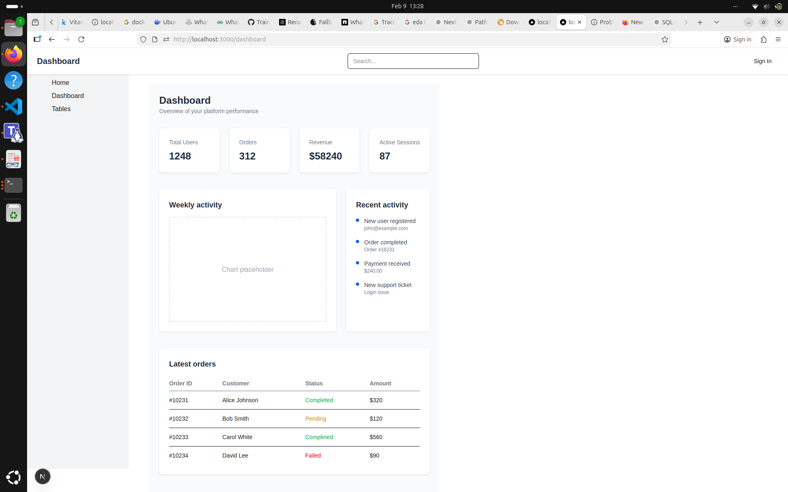
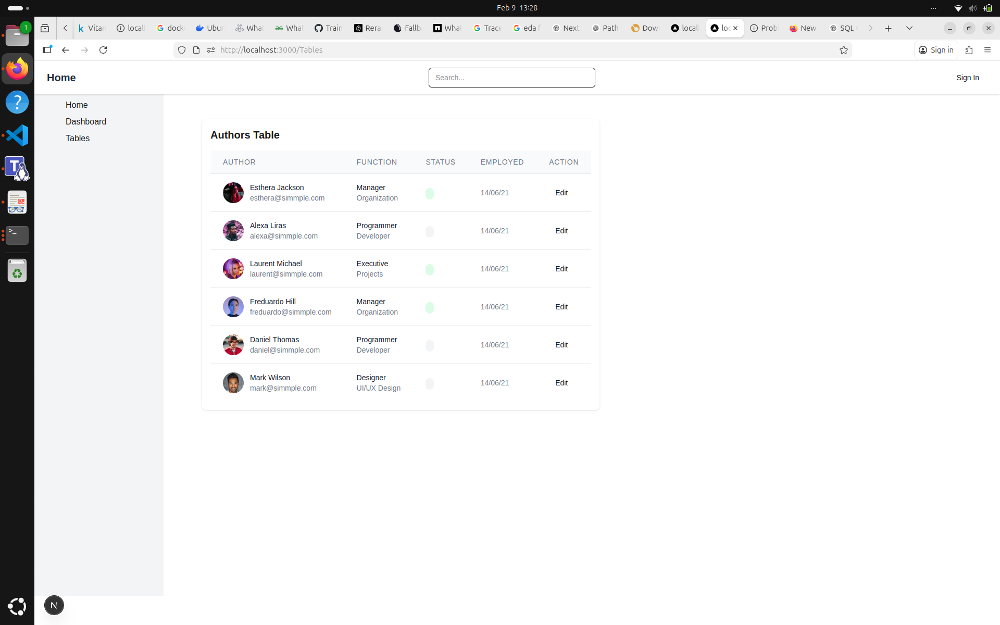
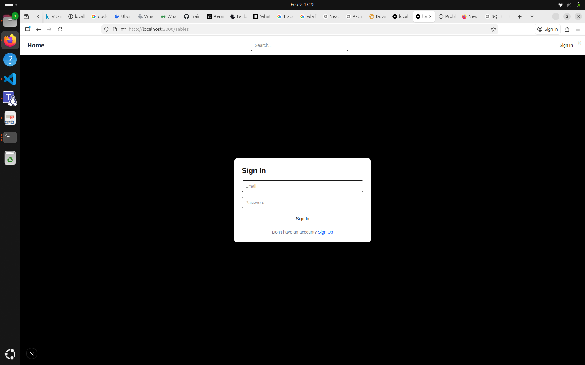
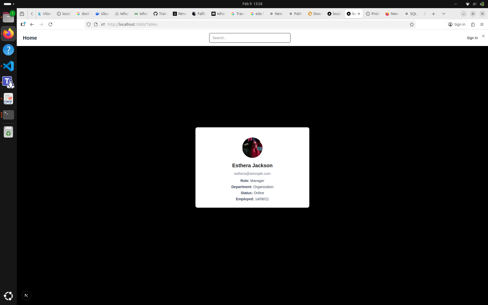

🚀 Next.js Dashboard Application

A modern dashboard-style web application built with Next.js App Router, reusable UI components, and a clean folder structure.
The project includes authentication UI, dashboard views, tables, charts and reusable UI building blocks.

🖥️ Tech Stack

Next.js (App Router)

React (JSX only – no TSX pages/components)

Tailwind CSS

Client Components where required ("use client")

📸 Screenshots

All screenshots are stored inside:

docs/screenshots/

| Page      | Screenshot                                   |
| --------- | -------------------------------------------- |
| Home      |            |
| Dashboard |  |
| Tables    |        |
| Sign In   |       |
| Profile   |      |

📁 Folder Structure

This is generated directly from:

tree -a -I "node_modules|.next|.git"

.
├── app
│   ├── dashboard
│   │   └── page.jsx
│   ├── favicon.ico
│   ├── globals.css
│   ├── layout.jsx
│   ├── page.jsx
│   ├── SignIn
│   │   └── page.jsx
│   └── Tables
│       └── page.jsx
├── components
│   ├── Badge.jsx
│   ├── Button.jsx
│   ├── Card.jsx
│   ├── Chart.jsx
│   ├── index.jsx
│   ├── Input.jsx
│   ├── Modal.jsx
│   ├── navbar.jsx
│   ├── sidebar.jsx
│   └── Table.jsx
├── docs
│   ├── folder-structure.txt
│   └── screenshots
│       ├── dashboard.png
│       ├── home.png
│       ├── profile.png
│       ├── signIn.png
│       └── tables.png
├── eslint.config.mjs
├── .gitignore
├── Images
│   ├── avatars
│   │   ├── avatar10.png
│   │   ├── avatar1.png
│   │   ├── avatar2.png
│   │   ├── avatar3.png
│   │   ├── avatar4.png
│   │   ├── avatar5.png
│   │   ├── avatar6.png
│   │   ├── avatar7.png
│   │   ├── avatar8.png
│   │   └── avatar9.png
│   ├── BackgroundCard1.png
│   ├── BgSignUp.png
│   ├── ImageArchitect1.png
│   ├── ImageArchitect2.png
│   ├── ImageArchitect3.png
│   ├── people-image.png
│   ├── ProfileBackground.png
│   ├── SidebarHelpImage.png
│   └── signInImage.png
├── next.config.js
├── next.config.ts
├── next-env.d.ts
├── package.json
├── package-lock.json
├── postcss.config.mjs
├── public
│   ├── avatars
│   │   ├── avatar10.png
│   │   ├── avatar1.png
│   │   ├── avatar2.png
│   │   ├── avatar3.png
│   │   ├── avatar4.png
│   │   ├── avatar5.png
│   │   ├── avatar6.png
│   │   ├── avatar7.png
│   │   ├── avatar8.png
│   │   └── avatar9.png
│   ├── BackgroundCard1.png
│   ├── BgSignUp.png
│   ├── feature1.png
│   ├── feature2.png
│   ├── feature3.png
│   ├── file copy.svg
│   ├── file.svg
│   ├── globe copy.svg
│   ├── globe.svg
│   ├── hero.png
│   ├── ImageArchitect1.png
│   ├── ImageArchitect2.png
│   ├── ImageArchitect3.png
│   ├── next copy.svg
│   ├── next.svg
│   ├── people-image.png
│   ├── ProfileBackground.png
│   ├── SidebarHelpImage.png
│   ├── signInImage.png
│   ├── user1.png
│   ├── user2.png
│   ├── vercel copy.svg
│   ├── vercel.svg
│   ├── window copy.svg
│   └── window.svg
├── README.md
├── style
│   └── global.css
└── tsconfig.json

🧩 Pages (App Router)
Route	File
/	app/page.jsx
/dashboard	app/dashboard/page.jsx
/Tables	app/Tables/page.jsx
/SignIn	app/SignIn/page.jsx
🧱 Components List

This list is generated from:

grep -R --include="*.jsx" -n "export default function" app components

App level components (pages & layout)

HomePage → app/page.jsx

SignInPage → app/SignIn/page.jsx

RootLayout → app/layout.jsx

UsersPage → app/Tables/page.jsx

DashboardPage → app/dashboard/page.jsx

Shared UI components

Button → components/Button.jsx

Sidebar → components/sidebar.jsx

Card → components/Card.jsx

Table → components/Table.jsx

Badge → components/Badge.jsx

Navbar → components/navbar.jsx

Modal → components/Modal.jsx

Chart → components/Chart.jsx

Input → components/Input.jsx

🧠 Lessons Learned
1. Next.js App Router structure

Learned how routing is driven by folders and page.jsx files inside the app/ directory instead of the old pages/ directory.

2. Server vs Client Components

Understood when and why to use:

"use client";

Especially for:

forms

modal interactions

stateful UI (SignIn, Navbar, Modals, Charts, etc.)

3. Clean component separation

Improved code quality by separating:

pages (routing layer)

reusable UI components (components/)

This allows:

better reusability

easier testing

cleaner layout structure

4. Handling static assets correctly

Learned the difference between:

public/ (served directly by Next.js)

project folders like Images/ (not automatically public)

5. File-based imports and path issues

Faced and fixed real issues related to:

incorrect relative imports

wrong component paths

case-sensitive filenames on Linux

6. Debugging Next.js build & runtime errors

Learned how to debug:

Module not found

The default export is not a React Component

mismatched Next / SWC / React versions

broken routes caused by incorrect folder layout

7. Reusable UI design

Implemented reusable UI blocks such as:

cards

tables

badges

charts

modals

buttons

inputs

which helped keep page files small and readable.

▶️ Run the project
npm install
npm run dev

Then open:

http://localhost:3000

📌 Notes

All pages and components are written in JSX (not TSX).

TypeScript is only present for tooling (tsconfig.json, next-env.d.ts).

Screenshots and documentation assets are stored inside the docs/ folder.

